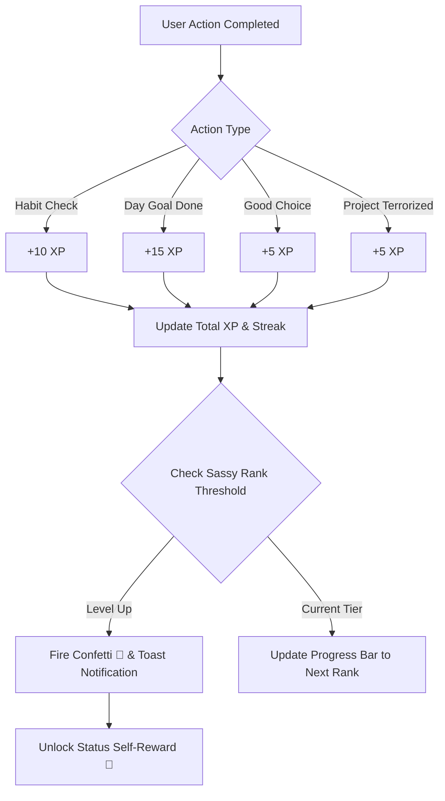

# Personal App Builder Playbook & Design System
**The Architectural & UX Blueprint for Building Fast, Minimalist, High-Impact Apps**

---

## 1. Executive Philosophy & Guiding Tenets

Every tool built under this blueprint exists to reduce friction, drive relentless momentum, and eliminate mental overhead. 

```
                 ┌──────────────────────────────────────┐
                 │   Simple. Visible. Next step. Done.  │
                 └──────────────────┬───────────────────┘
                                    │
         ┌──────────────────────────┴──────────────────────────┐
         ▼                                                     ▼
┌───────────────────────────────┐             ┌───────────────────────────────┐
│     Display Over Data         │             │    Momentum Over Roadmap      │
│ If you can't see it at a      │             │ Know your immediate move, not │
│ glance, fix the UI, not data. │             │ the entire 6-month roadmap.   │
└───────────────────────────────┘             └───────────────────────────────┘
```

### Core Principles
1. **Single Pane of Glass (The Single Daily Sheet)**: Never hide vital actions behind deep tab trees, drawer mazes, or nested settings. Everything you need to assess and execute lives on a single, continuous, scroll-friendly sheet.
2. **Action Precedes Tracking**: Good choices and active decisions come before passive lists.
3. **"Currently Terrorizing" Mentality**: Replace stale project task lists with an active, high-energy focus shelf. You are either actively conquering a project right now, or it stays parked in grey.
4. **Sassy, High-Personality Voice**: Standard productivity tools are sterile and boring. Accountability should have bite, humor, and swagger. Rewards should feel playful and earned.
5. **Zero-Dependency Portability**: No heavy Node/React/Webpack build chains when vanilla HTML5, modern CSS, and plain ES6 JavaScript can deliver 60fps performance, instant load times, and effortless hosting.
6. **Local-First Privacy with Optional Real-Time Sync**: All personal entries live in the user's browser `localStorage` by default. Cross-device syncing is powered by lightweight, serverless real-time streams with 1-tap pairing.

---

## 2. Design System: "Obsidian & Icy Lavender"

A modern minimalist, Nordic-inspired editorial aesthetic with cool purple accents.

```
LIGHT THEME (Icy Lavender)           DARK THEME (Deep Obsidian)
┌───────────────────────────────┐   ┌───────────────────────────────┐
│ Background:   #F4F5FB         │   │ Background:   #080A11         │
│ Card Surface: #FFFFFF         │   │ Card Surface: #0F121D         │
│ Inner Surface:#F8F9FD         │   │ Inner Surface:#161B29         │
│ Accent:       #7C5CFC         │   │ Accent:       #9D85FF         │
│ Text Primary: #161823         │   │ Text Primary: #ECEEF8         │
│ Text Muted:   #6C7289         │   │ Text Muted:   #798099         │
│ Border Light: #E3E6F0         │   │ Border Light: rgba(255.. 0.08)│
└───────────────────────────────┘   └───────────────────────────────┘
```

### Color Variables (CSS Tokens)

```css
:root {
  /* Core Accents */
  --primary: #7C5CFC;            /* Signature Electric Purple */
  --primary-hover: #6848E6;
  --primary-light: rgba(124, 92, 252, 0.10);
  --primary-border: rgba(124, 92, 252, 0.32);
  --primary-glow: rgba(124, 92, 252, 0.25);

  /* Light Canvas (Icy Lavender) */
  --bg-page: #F4F5FB;
  --bg-card: #FFFFFF;
  --bg-surface: #F8F9FD;
  --bg-surface-hover: #EFF1FA;
  --text-primary: #161823;
  --text-secondary: #4A5168;
  --text-muted: #7C849B;
  --border-light: #E3E6F0;
  --border-strong: #CDD2E2;

  /* MARGO Category Identity Colors */
  --margo-m: #4E8765; /* Move (Foundation Green) */
  --margo-a: #D97768; /* Aesthetic (Coral/Clay) */
  --margo-r: #7979B8; /* Reflect (Slate Iris) */
  --margo-g: #D49B35; /* Grow (Amber) */
  --margo-o: #3E5C76; /* Organize (Deep Steel) */

  /* Radii & Geometry */
  --radius-sm: 6px;
  --radius-md: 10px;
  --radius-lg: 16px;
  --radius-full: 9999px;
}

[data-theme="dark"] {
  --bg-page: #080A11;
  --bg-card: #0F121D;
  --bg-surface: #161B29;
  --bg-surface-hover: #1E2436;
  --text-primary: #ECEEF8;
  --text-secondary: #A6AFC7;
  --text-muted: #6F7891;
  --border-light: rgba(255, 255, 255, 0.08);
  --border-strong: rgba(255, 255, 255, 0.16);
  --primary-light: rgba(124, 92, 252, 0.16);
  --primary-border: rgba(124, 92, 252, 0.40);
}
```

### Typography Hierarchy

```css
/* Font Stack */
--font-sans: 'Inter', -apple-system, BlinkMacSystemFont, 'SF Pro Display', sans-serif;
--font-serif: 'Newsreader', Georgia, serif;
--font-mono: 'JetBrains Mono', monospace;
```

* **Editorial Headers & Mottos**: `Newsreader`, italic or medium weight, generous line-height (`1.2–1.35`). Adds literary refinement and executive authority.
* **UI Controls & Labels**: `Inter`, weights `500`, `600`, `700`, `800`. Tight letter spacing (`-0.015em`), crisp micro-caps for status indicators (`text-transform: uppercase`, `letter-spacing: 0.05em`).
* **Metrics & Numbers**: `Inter` weight `800` or `JetBrains Mono` for percentages, day tallies, and points.

---

## 3. Core UX Patterns & Signature Components

### 1. The Single Daily Sheet Architecture
* **Single Column Container**: Centered, `max-width: 680px`, `padding: 16px 20px`. Fits full screen on mobile and stays elegant and focused on large desktop displays.
* **Pinned Principles Banner**: 3–5 short operational mantras pinned at the very top of the sheet to ground every session before tracking begins.
* **Touch Targets**: Every clickable element (checkbox, button, pill) maintains a **minimum $\ge 44\text{px}$** interactive touch target for thumb ergonomics on iPhone.

### 2. "Currently Terrorizing" Focus Shelf
Instead of an endless backlog, the shelf highlights the 3–5 focus initiatives you are actively conquering:
* **Inactive State**: Soft neutral grey badge (`--bg-surface`), subdued text.
* **Active State**: Inverts to glowing purple pill (`background: var(--primary); color: white; box-shadow: 0 0 12px var(--primary-glow);`).
* **Emoji Indicator**: Prepends `⚡` to signify active pursuit.
* **Gamification Hook**: Toggling on gives immediate positive reinforcement (+5 XP).

### 3. Sassy Gamification Engine
Productivity should be irreverent and rewarding.



#### Sassy Status Tiers Reference
| Tier Badge | Rank Title | XP Threshold | Sassy Flavor Text | Unlocked Self-Reward |
| :--- | :--- | :--- | :--- | :--- |
| 🥔 | **Bed Potato** | 0 XP | *"Contemplating breathing. The bar was in hell, but you're thinking about it."* | 10 minutes of completely guilt-free ceiling staring |
| 🌱 | **Slightly Less Useless** | 50 XP | *"You actually got vertical. Society thanks you for the bare minimum."* | Fancy iced latte with zero financial remorse |
| ⚡ | **Functional Menace** | 150 XP | *"Rumor has it you have your life together today. Let's not jinx it."* | 30 minutes of undisturbed high-taste internet browsing |
| 👑 | **Chief Chaos Officer** | 300 XP | *"Operating at dangerously high momentum. Someone check on your enemies."* | Order that fancy lunch you've been eyeing all week |
| 🔥 | **Goblin Mode Overachiever**| 500 XP | *"Who authorized this much discipline? God complex loading..."* | 1 guilt-free online shopping purchase or book treat |
| 🚀 | **Weapon of Mass Productivity**| 800 XP | *"You're terrorizing your goals so hard they're calling customer support."* | A full evening off with zero productivity guilt |
| ✨ | **Supreme Living Legend** | 1200+ XP | *"You won life. They should build a bronze monument in your living room."* | Crown yourself, take the rest of the weekend off |

### 4. Interactive Past-Date Navigation & Catch-Up Matrix
Users forget to check items on busy days. Never penalize a streak if the user did the work:
1. **Clickable 7-Day Consistency Strip**: Each day dot (`Sun` to `Sat`) in the streak tracker is an active button. Tapping any day immediately loads that day's sheet.
2. **Past Date Alert Banner**: When viewing any date before today:
   ```html
   <div class="past-date-banner">
     <span>🕒 Viewing Past Date: <strong>Thursday, Sep 4</strong></span>
     <button onclick="resetToToday()">↩ Return to Today</button>
   </div>
   ```
3. **Catch-Up Matrix Modal**: A full-week overview table allowing the user to check off Monday through Sunday in a 5-second session.
4. **Dynamic Streak Calculation**: Recalculates backwards consecutive days from today; retroactively checking yesterday or earlier days immediately restores and grows the anchor streak.

---

## 4. Technical Architecture

```
┌─────────────────────────────────────────────────────────────┐
│                       Client Device                         │
│                    (iPhone / Mac Safari)                    │
│                                                             │
│  ┌──────────────────────┐        ┌───────────────────────┐  │
│  │   UI Presentation    │        │  Local-First Storage  │  │
│  │   (index.html + CSS) │◄──────►│  (localStorage V2)   │  │
│  └──────────────────────┘        └──────────┬────────────┘  │
└─────────────────────────────────────────────┼───────────────┘
                                              │ Realtime Stream
                                              ▼ (PUT & SSE EventSource)
                               ┌──────────────────────────────┐
                               │   Firebase Realtime Database │
                               │    (Instant Cloud Relay)     │
                               └──────────────────────────────┘
```

### Zero-Dependency Stack
* **Markup**: Semantic HTML5 with PWA viewport headers.
* **Icons**: [Lucide Icons](https://lucide.dev) via CDN (`<script src="https://unpkg.com/lucide@latest"></script>`).
* **Visual Effects**: [Canvas Confetti](https://github.com/catdad/canvas-confetti) for reward bursts.
* **Storage**: Local-First via `localStorage` with JSON serialization.
* **Sync**: Direct REST + Server-Sent Events (`EventSource`) to Google Firebase Realtime Database. Zero backend code required.

### iOS PWA Optimization Checklist
Always include these in the `<head>` of mobile-first tools:
```html
<meta name="viewport" content="width=device-width, initial-scale=1.0, maximum-scale=1.0, user-scalable=no, viewport-fit=cover">
<meta name="apple-mobile-web-app-capable" content="yes">
<meta name="apple-mobile-web-app-status-bar-style" content="default">
<meta name="apple-mobile-web-app-title" content="Your App Name">
<!-- Cache Busting for Instant Mobile Deployments -->
<meta http-equiv="Cache-Control" content="no-cache, no-store, must-revalidate">
<link rel="stylesheet" href="css/theme.css?v=1.0">
<script src="js/app.js?v=1.0"></script>
```

### Instant 2-Way Real-Time Sync Pattern
```javascript
// Lightweight Firebase REST + SSE implementation
class RealtimeSync {
  constructor(dbUrl, secretPassphrase, onUpdate) {
    this.endpoint = `${dbUrl}/sync/${encodeURIComponent(secretPassphrase)}.json`;
    this.onUpdate = onUpdate;
    this.listen();
  }

  async push(data) {
    await fetch(this.endpoint, {
      method: 'PUT',
      headers: { 'Content-Type': 'application/json' },
      body: JSON.stringify(data)
    });
  }

  listen() {
    this.eventSource = new EventSource(this.endpoint);
    this.eventSource.addEventListener('put', (e) => {
      const parsed = JSON.parse(e.data);
      if (parsed && parsed.data) this.onUpdate(parsed.data);
    });
  }
}
```

---

## 5. Master Prompt Template for Future Projects

Copy and paste the template below whenever starting a new app or tool with an AI assistant:

```markdown
I want to build a new tool/app: [DESCRIBE APP IDEA HERE].

Please build this following my personal App Playbook & Design Specifications:

1. AESTHETICS & THEME:
   - Nordic Minimalist / Obsidian & Icy Lavender aesthetic.
   - Clean purple primary accent (#7C5CFC) with subtle glow effects.
   - Light theme: Icy Lavender (#F4F5FB) with crisp white cards (#FFFFFF).
   - Dark theme: Deep Obsidian (#080A11) with deep navy-slate cards (#0F121D).
   - Typography: 'Inter' for UI controls & metrics; 'Newsreader' (italic serif) for editorial headers.
   - Flat, border-defined cards (1px solid var(--border-light)), smooth rounded corners (radius-lg: 16px).

2. UX ARCHITECTURE:
   - Single Daily Sheet / Single Pane of Glass layout (max-width: 680px, mobile-first, zero tabs).
   - Pinned Operational Reminders at the very top ("Simple. Visible. Next step. Done.").
   - Action-first layout (tracking & conscious decisions placed before passive lists).
   - Touch targets >= 44px for thumb-friendly iPhone Safari usage.
   - Date flexibility: clickable past-date navigation with a quick catch-up matrix.

3. PERSONALITY & GAMIFICATION:
   - Sassy, witty, irreverent tone of voice for status tiers, empty states, and toast messages.
   - Points engine (XP) with hilarious rank progression (e.g. Bed Potato -> Functional Menace -> Supreme Living Legend).
   - Self-reward milestone cards with celebratory confetti triggers.

4. TECH STACK:
   - Zero-dependency static stack: Pure HTML5, modular CSS, vanilla ES6 JavaScript.
   - Local-first architecture: All data persisted in localStorage.
   - Built-in JSON export/import for effortless manual backup.
   - Real-time cloud sync ready (Firebase Realtime Database REST/SSE with 1-tap iPhone QR pairing).
   - iOS PWA tags and cache-busting version query parameters (?v=...) included.

Please start by outlining the file structure and delivering the clean, modular code.
```
